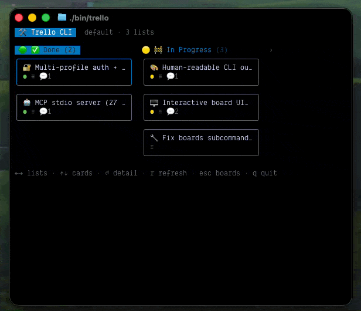

<p>
  
</p>

# Trelly -- Trello CLI

Fast Trello CLI + MCP server ([npm](https://www.npmjs.com/package/trelly): `npm install -g trelly`).
**Human, Trello-styled output by default**; add `--json` for scripts and automation.
Commands: **`trelly`** (CLI) and **`trelly-mcp`** (MCP server).



Boards, lists, cards, checklists, labels, custom fields, search, webhooks, multi-profile
auth, interactive kanban TUI, raw `trelly api` escape hatch.

## Install

```bash
npm install -g trelly                   # npm (Node 22+)
brew install brandonkramer/tap/trelly   # Homebrew
bunx trelly                             # run without installing (Bun)
npx trelly                              # run without installing (Node 22+)
```

From source (repo [brandonkramer/trelly](https://github.com/brandonkramer/trelly)):

```bash
git clone https://github.com/brandonkramer/trelly.git && cd trelly
bun install
./bin/trelly auth setup
./bin/trelly auth login
./bin/trelly boards list
```

No Bun? `npm install` in the clone — tsx is the fallback runtime.

Optional: `bun link` / `npm link`, or add `bin/` to `PATH`.

### Updating

```bash
npm update -g trelly          # or: npm install -g trelly@latest
brew upgrade trelly           # Homebrew
```

Auth in `~/.config/trelly/config.json` is kept across upgrades. Reload your IDE after
updating if you use the agent plugin MCP server.

## Quick start

```bash
trelly auth setup    # once: API key from power-ups/admin
trelly auth login    # browser → Allow
trelly boards list
```

## Output

| Mode | Command | stdout |
|------|---------|--------|
| Default | `trelly boards list` | Styled rows (labels, due badges, etc.) |
| JSON | `trelly --json boards list` | `{ ok, profile, data }` |
| Pretty JSON | `trelly --json --pretty boards list` | Indented envelope |

- **Errors:** red `✗ message` in human mode, exit code `1` (use `--json` for `{ ok: false, ... }`).
- **Pipes:** colors auto-disable when stdout is not a TTY.
- **Scripts:** always pass `--json` if you parse stdout. The MCP server is unchanged (never uses CLI output).

## Interactive UI

Bare **`trelly`** (no subcommand) opens the Ink kanban board in your terminal — same as `trelly ui`.

```bash
trelly              # board picker when no id given
trelly ui           # same
trelly ui BOARD_ID  # jump straight to a board
```

Requires a TTY. Keys: **arrows** / **hjkl** move focus, **Enter** card detail, **r** refresh, **q** / **Esc** back or quit.

In card detail: **↑↓** move over attachments and comments, **Enter** opens the focused attachment in your browser or expands/collapses the focused comment, **c** new comment, **r** reply to the focused comment (prefills `@author`), **a** attach a file path or URL, **Esc** back.

See the demo above or run `trelly --help` for all subcommands.

## Auth

Two steps: **API key** (app identity, once) → **token** (your account, per profile). After login the CLI is **you** on Trello — same boards and permissions as the website.

**1 · Get an API key (once).** `trelly auth setup` opens [power-ups/admin](https://trello.com/power-ups/admin) and prompts for the key:

1. Create a Power-Up — registers the app; nothing is installed on your boards.
2. Any workspace you **admin** (personal is fine); it doesn't limit board access.
3. Iframe URL: any `https://` placeholder.
4. API Key tab → **Generate API Key**; add `http://127.0.0.1:14189` to **Allowed Origins** (for browser login).
5. Paste the key at the prompt.

**2 · Log in.** `trelly auth login` — browser opens → **Allow**.

| Variant | Command |
|---------|---------|
| Redirect blocked | `auth login --manual` (paste token) |
| Never-expiring token | `auth login --full-access` (otherwise 30 days) |
| More accounts | `auth login --profile work` · `auth use work` · `auth logout -p work` · `-p` on any command |
| Inspect | `auth list` (profiles) · `auth url` (authorize URL) |
| Non-interactive | `auth setup --api-key KEY` then `auth login --api-key KEY --token TOKEN` |

Env overrides: `TRELLO_API_KEY` + `TRELLO_TOKEN` (bypass profiles), `TRELLO_PROFILE`, `TRELLO_APP_API_KEY`. Credentials: `~/.config/trelly/config.json` (mode `600`).

## Usage

```bash
trelly boards list
trelly --json --pretty boards list | jq '.data[].name'
trelly --profile work boards lists BOARD_ID
trelly cards create --list LIST_ID --name "Ship feature"
trelly cards comments CARD_ID
trelly cards comment CARD_ID --text "Shipped"
trelly cards edit-comment CARD_ID COMMENT_ID --text "Actually shipped"
trelly cards delete-comment CARD_ID COMMENT_ID # permanent
trelly cards add-attachment CARD_ID --file screenshot.png   # or --url https://…
trelly search "customer onboarding"
trelly api -X PUT --path /cards/CARD_ID --query idList=LIST_ID
trelly api -X POST --path /cards --body '{"idList":"LIST_ID","name":"Hi"}'
```

Flags: `-p, --profile <name>`, `--json`, `--pretty` (with `--json` only).

**Archive** (reversible) vs **delete** (permanent): prefer `cards archive` / `boards archive` over `cards delete` / `boards delete`.

### Command reference

Top-level: `auth` · `boards` · `lists` · `cards` · `checklists` · `labels` · `custom-fields` · `search` · `webhooks` · `members` · `orgs` · `actions` · `api` · `ui`

| Group | Subcommands |
|-------|-------------|
| **auth** | `setup` · `login` · `list` · `use` · `logout` · `url` |
| **boards** | `list` · `get` · `create` · `update` · `archive` · `delete` · `lists` · `cards` · `labels` · `members` · `actions` · `custom-fields` |
| **lists** | `get` · `create` · `update` · `archive` · `cards` |
| **cards** | `get` · `list` · `create` · `update` · `move` · `comments` · `comment` · `edit-comment` · `delete-comment` · `archive` · `delete` · `members` · `add-member` · `remove-member` · `labels` · `add-label` · `remove-label` · `actions` · `attachments` · `add-attachment` · `delete-attachment` · `custom-fields` |
| **checklists** | `get` · `create` · `update` · `delete` · `add-item` · `update-item` · `delete-item` |
| **labels** | `get` · `create` · `update` · `delete` |
| **custom-fields** | `get` · `create` · `update` · `delete` · `set-item` |
| **search** | `<query>` (`--model-types`, limits) |
| **webhooks** | `list` · `create` · `get` · `delete` |
| **members** | `me` |
| **orgs** | `get` · `boards` |
| **actions** | `get` |
| **api** | raw REST (`-X`, `--path`, `--query`, `--body`) |
| **ui** | `[boardId]` — or run bare `trello` / `trelly` |

List-type custom field values: use `trelly api` with `PUT /cards/{id}/customField/{fieldId}/item` and `{"idValue":"..."}` (see [skills/trelly/SKILL.md](skills/trelly/SKILL.md)).

Per-subcommand flags: `trelly <group> --help`. Curated examples and agent guidance: [skills/trelly/SKILL.md](skills/trelly/SKILL.md).

## MCP

Add `trelly` to your IDE or platform MCP server configuration (under `"mcpServers"`, see [mcp.example.json](mcp.example.json)):

```json
"trelly": {
  "command": "trelly-mcp",
  "env": { "TRELLO_PROFILE": "default" }
}
```

Typical configuration paths:
- **Cursor**: `~/.cursor/mcp.json`
- **Claude Desktop**: `~/Library/Application Support/Claude/claude_desktop_config.json` (macOS) or `~/.config/Claude/claude_desktop_config.json` (Linux)
- **Antigravity (`agy`)**: `~/.gemini/antigravity/mcp_config.json`
- **Codex**: `~/.codex/config.toml` (TOML format under `[mcp_servers.trelly]`)

After `npm install -g trelly`, `trelly-mcp` is on your PATH. From a clone, use the full path to `bin/trelly-mcp`.

Stdio server — JSON envelope on every tool (`{ ok, profile, data }`), never CLI human output. Pass **`profile`** on any tool for a non-default account. Prefer **`trello_*_archive`** over **`trello_card_delete`** (permanent; no board-delete MCP tool).

### MCP response cache

The MCP process keeps up to 200 successful GET responses in memory, keyed by auth
profile, path, and normalized query fields. Identical concurrent GETs share one
Trello request. Writes invalidate related card/list/board/search entries; errors,
429s, and mutation results are never cached.

| Read | TTL |
|------|-----|
| Boards, lists, labels | 30s |
| Cards, board cards, list cards | 5s |
| Comments, attachments | 3s |
| Search | 7.5s |

Pass `fresh: true` to a read tool (including `trello_api_get`) to bypass and
refresh the cache. Set `TRELLO_CACHE=0` in the MCP server environment to disable
caching and in-flight deduplication. The CLI does not use this cache.

### MCP tools (30)

| Tool | Purpose |
|------|---------|
| `trello_profiles_list` | Saved profiles + default |
| `trello_member_me` | Authenticated member |
| `trello_boards_list` | Member boards |
| `trello_board_create` | Create board |
| `trello_board_archive` | Close board (reversible) |
| `trello_board_context` | Board + optional lists, labels, cards, and card `display` |
| `trello_list_create` | Create list |
| `trello_list_cards` | Cards in list |
| `trello_card_create` | Create card |
| `trello_card_update` | Update card fields |
| `trello_card_move` | Move to another list |
| `trello_card_comment_create` | Add comment |
| `trello_card_comment_update` | Edit comment |
| `trello_card_comment_delete` | **Permanently delete comment** |
| `trello_card_archive` | Close card (reversible) |
| `trello_card_delete` | **Permanent** delete |
| `trello_card_context` | Card + optional board, list, comments, attachments, and checklists |
| `trello_card_attachment_add` | Attach a URL to a card |
| `trello_card_attachment_delete` | **Permanently delete attachment** |
| `trello_checklist_create` | Checklist on card |
| `trello_checklist_add_item` | Checklist item |
| `trello_label_create` | Board label |
| `trello_card_add_label` | Label on card |
| `trello_search` | Search Trello |
| `trello_resolve` | Resolve card/board/list name or URL to IDs |
| `trello_webhooks_list` | Token webhooks |
| `trello_webhook_create` | Create webhook |
| `trello_webhook_delete` | Delete webhook |
| `trello_api_get` | Read-only REST escape hatch |
| `trello_api_mutate` | Write-capable REST escape hatch |

`trello_board_context` replaces separate board get/list/card reads; use `include`
plus the resource field controls to fetch only what the task needs. When cards are
included, its `display` is ready to show to users. `trello_card_context` similarly
handles card details, comment reads, and attachment reads in one selective call.

Full tool notes and MCP vs CLI guidance: [skills/trelly-mcp/SKILL.md](skills/trelly-mcp/SKILL.md).

## Development

```bash
bun run typecheck && bun test && bun run lint
```

CI runs the same via `bun install --frozen-lockfile`. See `AGENTS.md` for conventions.

## Agent skills & plugins

Skills + IDE plugins ship in the npm package so agents learn CLI/MCP conventions
(card **`display`** lists, GitHub links, archive vs delete).

**Install trelly + auth once**, then pick your platform:

| Platform | Install |
|----------|---------|
| **Pi** | `pi install npm:trelly` (skills + CLI only) |
| **Claude Code** | `claude plugin install "$(npm root -g)/trelly"` → reload |
| **Cursor** | `cp -R "$(npm root -g)/trelly" ~/.cursor/plugins/local/trelly` → reload window |
| **Codex** | Local marketplace → `/plugins` → install Trelly |
| **Antigravity** | `agy plugin install "$(npm root -g)/trelly/.antigravity-plugin"` |

```bash
npm install -g trelly && trelly auth setup && trelly auth login
```

Step-by-step for each platform, verify/update, and MCP-only fallback:
**[skills/README.md](skills/README.md)** · **[CHANGELOG.md](CHANGELOG.md)**

Also: [PLUGIN.md](PLUGIN.md) · [PRIVACY.md](PRIVACY.md)

## License

MIT
